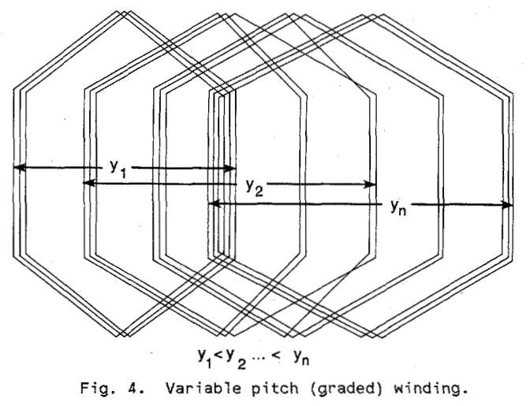

Winding Configurations
**********************

Various type of winding configuration of induction launchers can be found in the literature:

.. rubric:: Double-sided: :cite:`driga:1986`

.. rubric:: Tubular or coaxial:

.. % coaxial veya tubular yapıyı belli edecek bir görsel eklenmesi gerekiyor.

# The term coaxial implies the axial symmetry of the traveling (inductor) field and the armature induced field. Only the tubular induction accelerator has the circular symmetry implied by the term coaxial :cite:`driga:1986`.

.. rubric:: Variable pitch (graded) winding:

# The variable pitch winding, which sometimes is called a graded winding, is fabricated by increasing the coil spacings - thus increasing the traveling field velocity towards the end of the launcher – for the tubular construction :cite:`driga:1986`.

    : Variable pitch winding.

