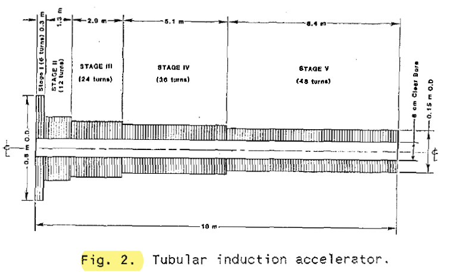
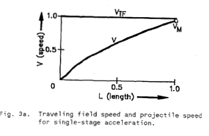
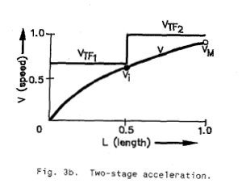

************
Introduction
************

[T] In the literature, there are two main types of electromagnetic launcher. The main difference of these types that supply current is *direct connected* to armature (**railgun**) or *induced* in the armature (**coilgun**). For the railguns the armature and stator current, relative position and velocity of each other are independent. For the coilguns hte induced armature current is a fuction of the stator current and its position and velocity :cite:`engel:2017`. Other kinds of launchers and **classifications** can be found in the literature :cite:`weldon:1989` :cite:`engel:2017`. 

[T][C] Electromagnetic induction launchers or accelerators have been called with different names in the literature: coaxial, tubular induction or magnetic accelerator. The name “θ-gun” was coined in 1982 [Burgees and Snare, 1982] and a more inclusive manner coilgun in 1987 [Snow, 1987] [Zabar and Joshi, 1987]. 

[T][C] There are three types of electromagnetic induction launcher concepts in the development stage [Haghmaram and Shoulaie, 2004]: the wound armature pulsed induction accelerator [Ingram et al., 1991], the solid armature pulsed induction coilgun [Kaye et al., 1991], and the travelling wave linear induction launcher (LIL) [Zabar et al., 1989].

.. history

[T] The basic physics of magnetic accelerators, in other words electromagnetic launchers (EML) has been well understood since Maxwell's time late in 19th century. Then, rotary magnetic motors such as the common induction motors have been more popular for decades. However, EMLs have not received the same attention :cite:`mongeau:1982`.

[T][C] A mechanically synchronized discrete coil was built by Northrup in the thirties. A traveling wave accelerator that use superconducting projectiles was proposed by Winterberg in 1966. In 1972, a brush-commutated helical accelerator was proposed by Thom and Norwood. In 1976, the first actively synchronized mass driver which use discrete coils with solid-state commutation was built by Kolm and O’Neill. In 1978 Bondaletov accelerated 2-gram aluminum rings to 5 km/s in a 1 cm length by pulsed induction. Kemmey, Gora and Snow invented a self-storing, brush-commutated, double helix launcher in 1981. A tubular launcher driven by flux compression generators that would accelerate hollow projectiles guided and reinforced by an internal mandrel was proposed by Cowan’s group in 1984 [Kolm and Mongeau, 1984] [Haghmaram and Shoulaie, 2004].

[T] In other words, it is only in the 1970s that they have been seriously investigated. By these years it has had two major difficulties. First, the windings of all motors were wound around a ferromagnetic material such as iron and alloys. But, EMLs must operate above 10 tesla that iron and its alloys will saturate in this region. In addition, iron-free construction was very difficult because of the presence of extreme structural forces. Second, the extremely high electrical power input needed makes it difficult to operate. For instance, the acceleration energy of over 10 MJ must be stored and then delivered in less than a millisecond :cite:`mongeau:1982`.

[C] A theoretical and experimental investigation of coaxial air core launchers that were driven by capacitor bank was performed by Mongeau in his thesis. Experimental test was done by a helical railgun and discrete coil launchers  :cite:`mongeau:1982`.

.. indüksiyon fırlatıcılar sınıfına değiniyor. anahtarlamalı ve anahtarlamasız (yürüyen dalga ile, bizimki gibi) olarak ikiye ayırmış.

# Using specific force as a type indicator for the IND-class EMLs is not useful, since all launchers in this class have VSF due to the variable coupling between the armature and stator. Additionally, the variable coupling causes the induced armature current to be variable so that the force expression will have the form given as [12] F ∝ ia(x)is Fs(x) (3) where ia(x) is the variable armature current. The launchers of this class use the method of commutation as a type designator, since this is what differentiates them. The various stator coils of an induction coil launcher, for example, are externally commutated (or switched) as the armature passes the stator, whereas the linear induction motor (referred to as the asynchronous induction coil launcher in [1]) is not commutated at all but rides a traveling wave. The names for these types are switched (SWI) and unswitched (USW) :cite:`engel:2017`.

Only the tubular induction accelerator has the circular symmetry implied by the term coaxial as shown in :numref:`tubular-induction-accelerator` :cite:`driga:1986`.

    : Tubular induction accelerator.

From the theory of the conventional rotating induction motors it is known that their energy efficiency for starting operation expressed in energy terms is less than 50%. For each unit of energy stored kinetically in the rotor, a greater amount is dissipated in the Joule heating of the rotor by slip losses :cite:`driga:1986`.

In exactly the same manner[4], a projectile accelerated from rest by a constant speed traveling field will be subject to the same slip losses, which amount to :math:`W_{PJ}`, for the entire launch period. Actually the projectile does not reach the speed of traveling field and the energy loss is (:numref:`single-stage-acceleration`) :cite:`driga:1986`

.. math::
    :label: W_pj

    W_{PJ} = \int_0^{v_{TF}} m_p (v_{TF}-v) dv = m_p (v_{TF} v_m - \frac{v_m^2}{2})

where :math:`m_p` is the projectile mass [kg], :math:`v_{TF}` is the speed of travelling field [m/s], :math:`v` is the instantaneous speed of projectile [m/s] and :math:`v_m` is the projectile output velocity (at the muzzle of the launcher).

    : Single-stage acceleration.

For a two stage system (:numref:`two-stage-acceleration`) comprising two traveling field speeds, the energy loss decreases considerably :cite:`driga:1986`.

    : Two-stage acceleration.

.. Birden fazla bölümden oluşan fırlatıcının daha verimli olduğundan bahsediyor.

The number of stages can be further increased which would considerably increase the energy efficiency and reduce to a minimum the Joule loss in the projectile. At the limit this corresponds to a continuous increase in the pole pitch or a continuous change in the frequency of the currents producing the traveling field (Fig 3 c ) :cite:`driga:1986`.

The variable pitch winding, which sometimes is called a graded winding, is fabricated by increasing the coil spacings - thus increasing the traveling field velocity towards the end of the launcher – for the tubular construction :cite:`driga:1986`.

.. RFG anlatılmış

The second manner to obtain an accelerated field is to continuously vary the supply frequency. This way, as the armature is accelerated down an essentially constant pitch stator winding, the driving frequency increases with the armature velocity. Of course, this is just the opposite of. what happens in an alternator or compulsator, as energy is extracted. Additionally, as the speed voltage of the accelerator rises, it is desirable for the voltage of the generator to rise as well :cite:`driga:1986`.

A CEM concept called the "rising frequency generator" (RFG) [6] is proposed to meet the power supply requirements of ,the coaxial accelerator. This device can utilize the electrical generating configuration of an alternator, low impedance alternator, or compulsator -- single or multiphase. It consists of a rotor and a stator having a moment of inertia many times higher than the rotor (a naturally occurring situation which can be tailored by design) both of which are initially rotating in the same direction, the stator rotational speed being somewhat higher. The electrical frequency of the output, of course, is a function of the differential speed, omega_s-omega_r, as is the generated voltage. As power is generated, equal and opposite torques will be applied to the rotor and stator, and the rotor will change speed faster (slow down) due to its lower inertia. As the rotor slows, the differential between rotor and stator speed increases, increasing frequency and output voltage and achieving the desired effect :cite:`driga:1986`. 

A variant of this RFG concept involves using a stationary stator with a rotating magnetic field produced by a multiphase AC excitation current.

By matching the generator voltage, frequency, rotor and stator inertias, and initial velocities to the requirements of the coaxial accelerator, an integrated power supply/accelerator system can be designed. An important part of this integration is done by mounting the pulse generator excitation source (i.e., homopolar generator) on the same shaft as the pulse generator thus forming a "cascade" of electrical machines essential to obtaining the proper, electromechanical energy conversion :cite:`driga:1986`.
