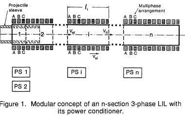
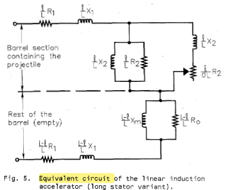

=========================
Linear Induction Launcher
=========================

:numref:`n-section-lil` illustrates the arrangement of the major components of the LIL, where: A, B, and C denote the phases; 1,2...i...n denote sections of the barrel; PS1 to PSn are the power supplies for those sections; and the moving part is the projectile sleeve. The barrel coils are given polyphase energization. This creates an electromagnetic wave packet traveling longitudinally with increasing velocity :math:`v_s`, satisfying :cite:`zabar:1989`

.. math::
    :label: v_s

    v_s = 2 \tau f

where :math:`\tau` is the pole pitch and f is the frequency of the traveling wave :cite:`zabar:1989`.

    : n-section LIL.

As long as there is a difference between the actual speed V of the projectile and the speed of the traveling wave Vs, the projectile sleeve carries induced azimuthal current, thus acting like the rotor of an asynchronous machine. The slip S between the two speeds is :cite:`zabar:1989`:

.. math::
    :label: slip

    s=\frac{v_s-v}{v_s}

The length of the sections is not fixed: as the speed increases, the section length does also.

The kinetic energy :math:`W_{ki}` to be transferred to the projectile in section i is: (where M is the total mass of the projectile) :cite:`zabar:1989`

.. math::
    :label: w_ki

    W_{ki} = M \frac{v_{1i}^2 - v_{0i}^2}{2}

The energy dissipated in the form of heat :math:`W_{hi}` in the sleeve, in each section, is given by :cite:`zabar:1989`:

.. math::
    :label: w_hi

    W_{hi} = W_{ki} \frac{s_{av.i}}{1 - s_{av.i}}

Where :math:`s_{av.i}=\frac{s_{0i}+s_{1i}}{2}` is the average slip in each section :cite:`zabar:1989`.

Since the transit time of the projectile through the barrel is only a few milliseconds, the heat transfer into the surrounding space is negligible. Therefore, the temperature rise :math:`\theta` of the sleeve will be :cite:`zabar:1989`:

.. math::
    :label: theta

    \theta = \frac{1}{cG} \sum_{i=1}^n W_{hi}

where :math:`c` is the specific heat of the sleeve material, :math:`G` its weight and n is the number of sections in the barrel. The mandatory requirement that :math:`\theta < \theta_{melt}`, where :math:`\theta_{melt}` is the melting temperature of the projectile material :cite:`zabar:1989`.

Equivalent Circuit
------------------

The equivalent circuit (:numref:`equivalent_circuit_of_lil`) represents a series connection [3] between the portion of the stator containing the projectile, where the electromechanical energy conversion takes place and the rest of the barrel which is many times longer. The first section of the equivalent circuit corresponds to the length of the projectile l (neglecting all the edge effects), the second one takes into account the rest of the barrel (L-l) where in addition to the energy loss in the stator, only reactive power is consumed :cite:`driga:1986`.

    : Equivalent circuit of the LIL.

Using a similar treatment as in classical theory of. linear induction motors [3,4], in the short rotor variant, the accelerating force is :cite:`driga:1986`

.. math::
    :label: force

    F = \frac{I^2 R_2 X_m^2}{v_s s \left[ (R_2/s)^2 + X_m^2 \right]}
