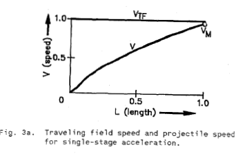

Operation Principles
====================

# From the theory of the conventional rotating induction motors it is known that their energy efficiency for starting operation expressed in energy terms is less than 50%. For each unit of energy stored kinetically in the rotor, a greater amount is dissipated in the Joule heating of the rotor by slip losses :cite:`driga:1986`.

# In exactly the same manner[4], a projectile accelerated from rest by a constant speed traveling field will be subject to the same slip losses, which amount to :math:`W_{PJ}`, for the entire launch period:

.. math::

    W_{PJ} = \int_0^t F_P s V_{TF} dt = m_p V_{TF} \int_0^t s \frac{dv}{dt} dt

# Changing the integration limits

.. math::

    W_{PJ} = m_p V_{TF} \int_0^{V_{TF}} (1-\frac{v}{V_{TF}}) dv

# where F_P = forced applied to projectile [N], 

.. math::

    s = \frac{V_{TF}-v}{V_{TF}} \times 100

[percent]

# Accelerating from rest to the speed of the traveling field and neglecting friction losses gives an amount of energyloss:

.. math::

    W_{PS} = m_p V_s \left[ v \frac{u^2}{2V_{TF}} \right]_0^{V_{TF}} = \frac{1}{2} m_p V_{TF}^2

# equal to the kinetic energy stored in the projectile. 

# Actually the projectile does not reach the speed of traveling field and the energy loss is (:numref:`single-stage-acceleration`) :cite:`driga:1986`

.. math::

    W_{PJ} = \int_0^{V_m} m_p (V_{TF}-v) dv = m_p (V_{TF} v_m - \frac{v_m^2}{2})

where :math:`m_p` is the projectile mass [kg], :math:`V_{TF}` is the speed of travelling field [m/s], :math:`v` is the instantaneous speed of projectile [m/s] and :math:`v_m` is the projectile output velocity (at the muzzle of the launcher).

    : Single-stage acceleration.

For a two stage system (:numref:`two-stage-acceleration`) comprising two traveling field speeds, the energy loss decreases considerably :cite:`driga:1986`.

.. math::

    W_{PJ2} = \int_0^{v_i} m_p (V_{TF1}-v) dv + \int_{v_i}^{v_m} m_p (V_{TF2}-v) dv

# If the intermediary speed v_i=v_m/2 and V_tf2=2V_tf1

.. math::

    W_{PJ2} = \frac{m_p V_m}{2} \left( \frac{3}{2} V_{TF2} - V_m \right)

.. figure:: ../img/two-stage-acceleration.png
    :align: center
    :scale: 100 %
    :name: two-stage-acceleration

    : Two-stage acceleration.

.. Birden fazla bölümden oluşan fırlatıcının daha verimli olduğundan bahsediyor.

# The number of stages can be further increased which would considerably increase the energy efficiency and reduce to a minimum the Joule loss in the projectile. At the limit this corresponds to a continuous increase in the pole pitch or a continuous change in the frequency of the currents producing the traveling field (:numref:`continuously-accelerating-driga1986`) :cite:`driga:1986`.

.. figure:: ../img/continuously-accelerating-driga1986.png
    :align: center
    :scale: 100 %
    :name: continuously-accelerating-driga1986

    : Continuously accelerating traveling field induction system.

# Such system wou;d produce an accelerating 'traveling field which ideally, will be followed closely by the projectile, keeping the slip (and consequently the losses) at constant, low values [ 3 ] , [ 4 ] .