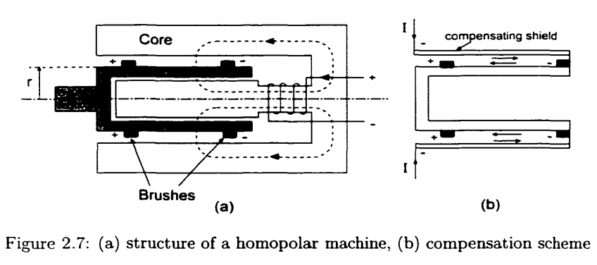

************
Power Supply
************

Driga et al. describes efforts to solve forcing the accelerator to conform to existing power supplies by pursuing the development of a coaxial launcher with an integrated pulsed power supply designed specifically to meet the requirements of the launcher :cite:`driga:1986`.

Another approach, used by Driga et al :cite:`driga:1986` is to design the coilgun as a linear induction motor, based on the model for conventional electrical machines :cite:`zabar:1989`.

Rising Frequency Generator
==========================

# A CEM concept called the "rising frequency generator" (RFG) [6] is proposed to meet the power supply requirements of ,the coaxial accelerator. This device can utilize the electrical  generating configuration of an alternator, low impedance alternator, or compulsator -- single or multiphase. It consists of a rotor and a stator having a lnoment of inertia many times higher than the rotor (a naturally occurring situation which can be tailored by design) both of which are initially rotating in the same direction, the stator rotational speed being somewhat higher. The e:ectrical frequency of the output, of course, is a function of the differential speed, :math:`\omega_s-\omega_r`, as is the generated voltage. As power is generated, equal and opposite torques will be applied to the rotor and stator, and the rotor will change speed faster (slow down) due toits lower inertia. As the rotor slows, the differential between rotor and stator speed increases, increasing frequency and output voltage and achieving the desired effect :cite:`driga:1986`. 

Homopolar Generator
===================

# A variant of this RFG concept involves using a stationary stator with a rotating magnetic field produced by a multiphase AC excitation current.

# By matching the generator voltage, frequency, rotor and stator inertias, and initial velocities to the requirements of the coaxial accelerator, or integrated power supply/accelerator system can be designed. An ixportant part of this integration is done by mounting the pulse generator excitation source (i.e., homopolar generator) on the same shaft as the pulse generator thus forminga "cascade" of electrical machines essential to obtaining the proper electromechanical energy conversion :cite:`driga:1986`.

# The rotating pulsed power supplies with fast and very fast discharge belong to both basic topologies: homopolar and heteropolar machines. Homopolar compensated electric generators employed as pulsed power supplies have, due to their term inal voltage value, a larger discharge period. For heteropolar machines such as compulsators, the discharging time is very small compared with the penetration time of the m agnetic field through the shields. Superconductivity assum ption is valid for these types of machines. However, for other types of pulsed electrical machines such as homopolar systems, the
penetration (current diffusion) affects the performance of the machine since the discharging time is relatively long (tens to hundreds of milliseconds) :cite:`oh2000:electromagnetics`.

# Figure 2.7 is the simplest structure of the homopolar machine. The conducting disk acts as the medium of kinetic energy storage. In Figure 2.7, voltage is induced at each brush on the rotor shaft and on the rim of the disk. Centrifugal stresses and brush friction limits the operation speed of the machine, thereby increasing the discharging time. For heteropolar machines such as compulsators, the discharging time of them are very small compared with the penetration time of the magnetic field through the rotor shields. Superconductivity assum ption is valid for these types of machines. However, for homopolar systems, the penetration speed of the fields (current diffusion) affects the performance of the machine since the discharging time is relatively long (150 milliseconds).

    : (a) structure of a homopolar machine, (b) compensation scheme.

# The emf induced between two brushes is :math:`Blv`. Since the average current path is the half of the disk radius (:math:`r` in Figure 2.7) and linear velocity :math:`v=\omega r`, the resulting emf for the homopolar machine is

.. math::

    emf = 1/2 B r^2 \omega

# Rewriting this emf in terms of the flux linkage :math:`\Phi=B\pi r^2`, we have the voltage equation for the homopolar machine:

.. math::

    V_t = \frac{\omega_m \Phi}{2 \pi}

# The angular velocity is limited by mechanical drawbacks of the machine such as brush friction and centrifugal stresses in the drum or the disk [29].

# The HPG can be modeled as a capacitor for a constant excitation field which is always the same. Even for self-excitation, the homopolar machine is discharged after the field has reached its prescribed value, during the flat part of the excitation curve. The expression for equivalent capacitance is obtained by equating the kinetic and electric energies.

.. math::

    1/2 J\omega^2 = 1/2 C V_t^2

# where

- :math:`J` : moment of inertia (kg m:sup:`2`)
- :math:`\omega` : angular velocity (rad/sec)
- :math:`C` : equivalent capacitance (F)
- :math:`V_t` : HPG voltage (V)
- :math:`\Phi` : total flux cut in one revolution

# The state variables for both the kinetic and electric energies are proportional to :math:`V_t` as long as the magnetic flux :math:`\Phi` is constant. Then the equivalent capacitance of the homopolar machine is found by following the same procedure we did to find the equivalent capacitance for the flywheel storage system. Substituting voltage equation :math:`V` to equation (2.10), we have an equivalent capacitance equation for the homopolar machines, (c.f. equation (2.7))

.. math::

    C_{eq} = \frac{4\pi^2 J}{\Phi^2}

# The homopolar machines of drum types are used for the EML installation at CEM-UT. The 9 M J single-shot hypervelocity electric gun system in Figure 2.8 has six HPGs and six inductive storages. Each homopolar machine has a rated voltage of 100 V and a peak discharge current of 1.5 million amps and is characterized by an equivalent electric capacitance of 2000 F. The inductance of the arm ature circuit is 0.11 fiH and its resistance is 7 (J.Q. The simplified presentation of modeling of the HPG as the capacitance is an RLC circuit hides the complexity of an electrical machine with a very elaborate mechanical design. It is also a heavy machine: the unit weight of one HPG is above 8 tons. Each inductive storage (Figure 2.9) has a 6.2 fiH and is rated for 1.2 M A peak current and has an insulation guaranteed for a voltage of 100 kV. The vacuum-impregnated and fiberglass-reinforced insulation allows easy access for inspections, repairs, and upgrades.

# Their load is a coaxial inductor. Between the homopolar rotor (cylindrical) and the compensating shield (tubular), the transmission fine must be designed as a coaxial fine made of coaxial tubes. The whole system can be modeled (during the discharge) with sufficient precision by an equivalent circuit :cite:`oh2000:electromagnetics`.

Compulsator
===========

# The compensated pulsed alternator (compulsator, CPA) was developed at the University of Texas at Austin as a power source for the electromagnetic launchers which need extremely large current in a very short period of time [32]. :cite:`oh2000:electromagnetics`

# Compensation techniques are developed to decrease the internal impedance of a machine. There are two types of compensation methods used for compulsators applied to railguns (Figure 2.10). One is the active compensation which acts like a rotating magnetic flux compressor producing the compensating field by a separate compensation winding. W hen the phase difference between the arm ature and the compensation winding is 180 degrees, we obtain the position of the lowest internal inductance. This is a complex method due to the additional compensation windings.

# The other method is the passive compensation. The passive compensation does not need additional windings but the rotor has the high-conductivity shield made of aluminum - The high-conductivity shield on the rotor produces image currents of the arm ature almost equal in magnitude but in opposite direction to the arm ature currents. The induced mirror currents establish the compensating fields. Using the passive compensation, we can drastically reduce the internal impedance of the machine and can increase many times the output current, resulting in the extremely high power densities. Using the anisotropic conductive material which has different electric conductivities in different directions and non-uniform shielding around the rotor (passive selective compensation), the performance of the passive compensation can be enhanced and used in the presence of self excitation [27].

# The current generated by the passive compensation is basically sinusoidal in shape since the conductive shield distributed evenly. However, by the active compensation, the current pulse is narrow and has a higher peak value. This is due to the inductance change during the rotor rotation. :cite:`oh2000:electromagnetics`

Disk Alternator
===============

1995 Electromagnetic aircraft launch system-EMALS
